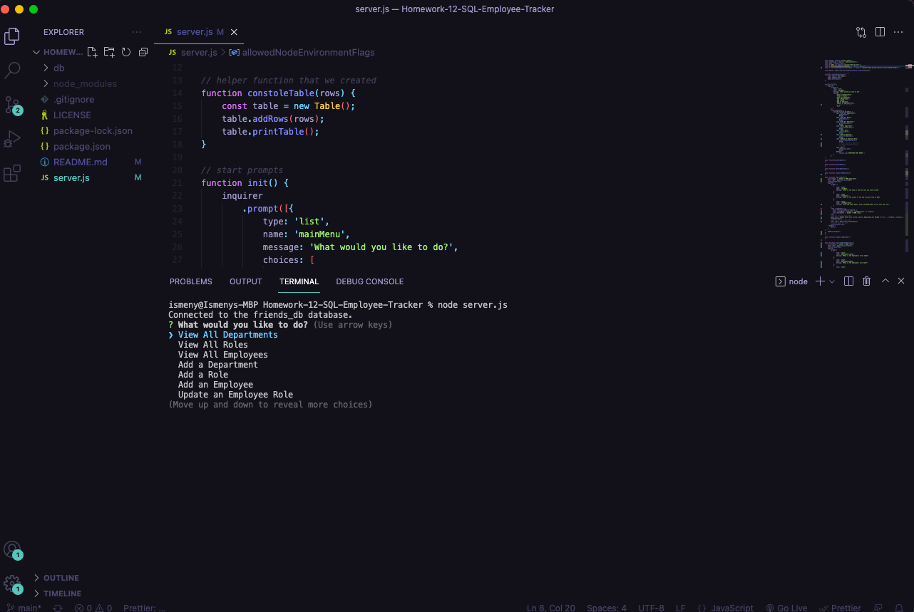

# Homework-12-SQL-Employee-Tracker

## Description
This application allows you to view and manage the departments, roles, and employees in your company.

## Table of contents
  - [Installation](#installation)
  - [Usage](#usage)
  - [Credits](#credits)
  - [License](#license)
  - [Test](#test)
  - [Questions](#questions)
  

## Installation
Video URL link  : ***https://watch.screencastify.com/v/ba1dEDIu6faGbhgEtjtM***  

## Usage
Open terminal and run command line "node server.js". The user will be presented with a series of options which include: view all departments, view all roles, view all employees, add a department, add a role, add an employee, and update an employee role. When the user chooses to view all departments, roles, and employees they will be presented with formatted table for each. When the user adds a new role, department, or employee they will also have be presented with a table that reflects those changes and updates. 

## Credits
This application uses:  
Express.js  
Inquirer  
Received help from:  
Jayla De'nae - peer  
Damien Luzzo - peer 

## License

## Contributions
n/a
## Test
n/a
## Questions
Github: Ismeny Saguilan - https://github.com/Ismeny  
Email: menysag2@gmail.com